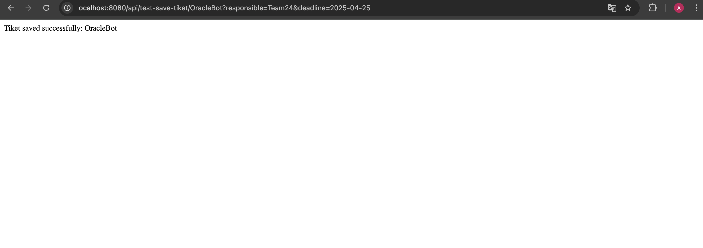
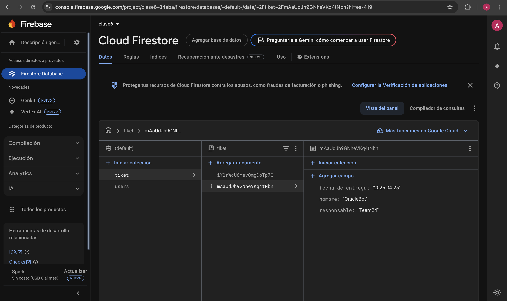

# Insertar datos en FireBase desde el servidor

**Ana Camila Jimenez Mendoza**  
*A01174422*  

Guadalajara, Jalisco  
Abril de 2025  

---

## Nuevo `MyController.java`:

```java
package com.interfazgrafica.version1.controllers;

import java.util.HashMap;
import java.util.Map;

import org.springframework.beans.factory.annotation.Autowired;
import org.springframework.web.bind.annotation.*;

import com.interfazgrafica.version1.services.FirebaseService;

@RestController
@RequestMapping("/api")
public class MyController {

    @Autowired
    private FirebaseService firebaseService;

    @PostMapping("/save/{name}")
    public String saveData(
            @PathVariable String name,
            @RequestBody Object data
    ) throws Exception {
        String collectionName = "users";
        firebaseService.saveData(collectionName, data);
        return "Data saved successfully for user: " + name;
    }

    @GetMapping("/test-save/{name}")
    public String testSaveData(
            @PathVariable String name,
            @RequestParam String email,
            @RequestParam int age
    ) throws Exception {
        String collectionName = "users";

        Map<String, Object> data = new HashMap<>();
        data.put("name", name);
        data.put("email", email);
        data.put("age", age);

        firebaseService.saveData(collectionName, data);
        return "Data saved successfully for user: " + name;
    }

    @GetMapping("/test-save-tiket/{nombre}")
    public String saveTiketData(
            @PathVariable String nombre,
            @RequestParam String responsible,
            @RequestParam String deadline
    ) throws Exception {
        String collectionName = "tiket";

        Map<String, Object> data = new HashMap<>();
        data.put("nombre", nombre);
        data.put("responsable", responsible);
        data.put("fecha de entrega", deadline);

        firebaseService.saveData(collectionName, data);

        return "Tiket saved successfully: " + nombre;
    }
}
```

---

## Evidencia de funcionamiento:




### URL de inserción:

```
http://localhost:8080/api/test-save-tiket/{nombre}?responsible={responsable}&deadline={deadline}
```

### Ejemplo:

```
http://localhost:8080/api/test-save-tiket/OracleBot?responsible=Team24&deadline=2025-04-25
```
